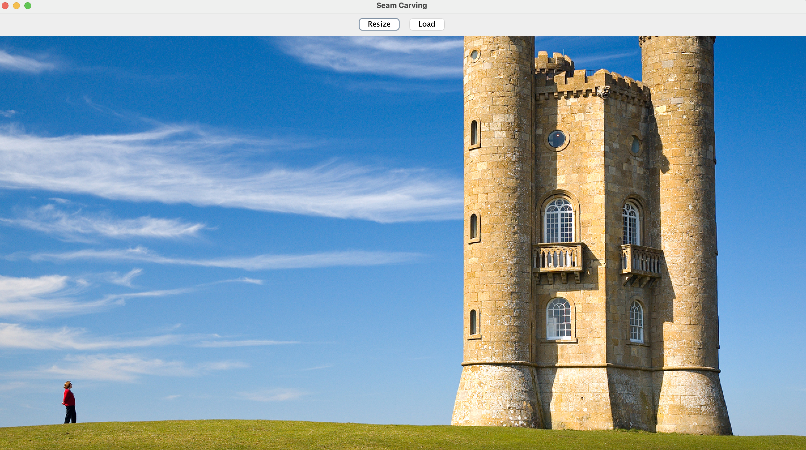
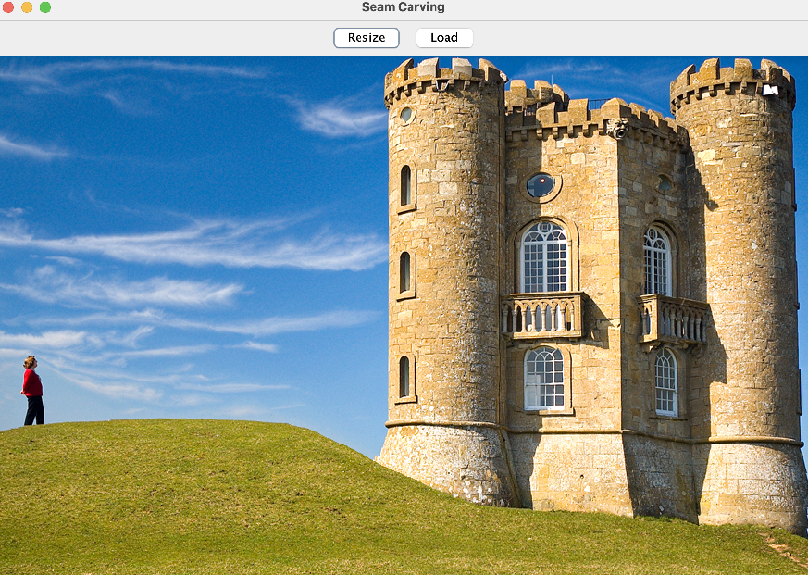

# Seam Carving

This project resizes images while using a seam carving method to avoid distorting the most important parts of the image.

More details on this method may be found [here](https://en.wikipedia.org/wiki/Seam_carving).

Sample image before resizing:

Sample image after resizing:

